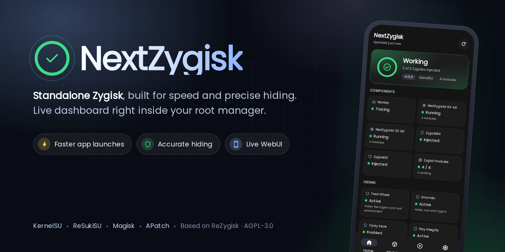
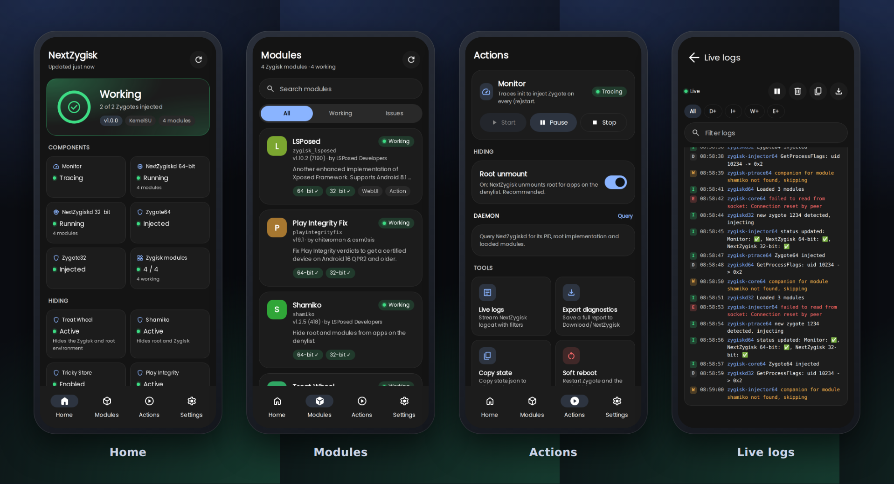

<p align="center">
  
</p>

<p align="center">
  <a href="https://github.com/ifoknr/NexTZygisk/actions/workflows/ci.yml"></a>
  
  
  <a href="LICENSE"></a>
</p>

<p align="center">
  <b>English</b> · <a href="READMEs/README_ar-SA.md">العربية</a>
</p>

# NextZygisk

**NextZygisk** is a standalone implementation of [Zygisk](https://github.com/topjohnwu/zygisk-module-sample): it lets Zygisk modules (LSPosed, Play Integrity Fix, Shamiko, Treat Wheel, ...) run on **KernelSU**, **ReSukiSU**, **Magisk** and **APatch**, and hides root from the apps you choose.

It is a fork of [ReZygisk](https://github.com/PerformanC/ReZygisk) by The PerformanC Organization, focused on three things: **faster app launches**, **robustness** and **accurate hiding**, with a modern dashboard you open straight from your root manager.

> [!WARNING]
> **Personal project, use at your own risk.** NextZygisk is developed and tested on the developer's own devices first. It runs as root inside Zygote, and a broken build can stop your phone from booting properly. Keep a way to remove modules (safe mode or your root manager's recovery options) before installing it.

> [!NOTE]
> NextZygisk keeps ReZygisk's module ID (`rezygisk`). It installs over an existing ReZygisk as an update, and modules that require ReZygisk (such as Treat Wheel) keep working.

## Contents

- [Highlights](#highlights)
- [Screenshots](#screenshots)
- [Compatibility](#compatibility)
- [Download](#download)
- [Installation](#installation)
- [Opening the dashboard](#opening-the-dashboard)
- [Hiding root](#hiding-root)
- [Troubleshooting](#troubleshooting)
- [Building from source](#building-from-source)
- [Developer](#developer)
- [Credits](#credits)
- [License](#license)

## Highlights

### ⚡ Faster app launches
Every app launch waits for NextZygisk to answer "is this app on the denylist? does it have root?". NextZygisk now answers from memory:

- **Magisk**: the root policies and denylist are loaded once and reloaded only when Magisk's database changes. This replaces up to three `magisk --sqlite` processes per app launch.
- **APatch**: `package_config` is parsed once instead of twice per launch.
- **Manager detection**: one `stat()` instead of scanning `/data/user` on every launch.

### 🛡️ Robust and accurate
More than a dozen bugs fixed in the daemon, the monitor and the code injected into Zygote. Among them:

- a stack overflow in the status writer;
- a 100% CPU loop in the monitor;
- the daemon shutting down because of one bad client;
- file descriptors leaking into companions;
- a possible wrong root-manager UID;
- double closes inside Zygote;
- an invalid `state.json` after any monitor stop.

### 📱 A dashboard inside your root manager
- **Home**: live status (monitor, daemons, Zygotes), warnings with the real reason, your hiding modules, and device information.
- **Modules**: **every** installed Zygisk module with its ID and its real status (working, partial, not working, disabled, reboot needed), plus *why* a module is not working.
- **Actions**: monitor controls, the root-unmount switch, a daemon query, a live log viewer, diagnostics export, soft reboot.
- **Settings**: themes (System, Dark, AMOLED, Light), 8 accent colors, auto refresh, 15 languages including full Arabic (right to left).

### 🔘 Action button
The root manager's **Action** button prints the full status as text, including every Zygisk module and whether it works. This is useful on Magisk, which has no built-in WebUI.

## Screenshots

<p align="center"></p>

## Compatibility

| Root solution | Minimum version | Notes |
|---|---|---|
| KernelSU | kernel 10940, ksud 11425 | |
| ReSukiSU / SukiSU | same KernelSU interface | Detected as KernelSU |
| KernelSU Next | same as KernelSU | |
| Magisk | 26402 | Disable Magisk's built-in Zygisk |
| APatch | 10655 | |

- **Android**: 7.1 (SDK 25) or newer.
- **Architectures**: arm64-v8a, armeabi-v7a, x86_64, x86.
- **Not supported**: having two root solutions installed at the same time, or installing from recovery.
- **Zygisk Next**: disabled automatically during installation, because two Zygisk implementations conflict.

## Download

| Where | What to pick |
|---|---|
| **[Releases](https://github.com/ifoknr/NexTZygisk/releases)** | The latest `NextZygisk-…-release.zip`, once releases are published. |
| **[GitHub Actions](https://github.com/ifoknr/NexTZygisk/actions/workflows/ci.yml)** | Open the latest successful run, then download `NextZygisk-…-release.zip` from **Artifacts**. You must be signed in to GitHub. |

Each build comes in two flavours:

- **release**: optimized and quiet. Use this one.
- **debug**: verbose logs. Use it only to collect logs for a bug report.

## Installation

1. Download the **release** zip.
2. Open your root manager (KernelSU / ReSukiSU / Magisk / APatch), go to **Modules**, tap **Install from storage** and pick the zip.
3. Read the install log. It starts with the NextZygisk logo and must end without errors.
4. **Magisk only**: go to Magisk **Settings** and turn **Zygisk** off. The built-in Zygisk conflicts with NextZygisk.
5. Reboot.

To check that it works, open the NextZygisk dashboard (see below). It should say **Working**, with every Zygote **Injected**. In the module list, the description shows the same state, for example:

```
[Monitor: ✅, NextZygisk 64-bit: ✅, NextZygisk 32-bit: ✅] Standalone implementation of Zygisk.
```

## Opening the dashboard

| Root manager | How |
|---|---|
| KernelSU / ReSukiSU / KernelSU Next / APatch | Modules → NextZygisk → **WebUI** (or tap the card) |
| Magisk | Tap **Action** on the NextZygisk module for a text status, or open the WebUI with a WebUI app such as [MMRL](https://github.com/MMRLApp/MMRL) or KsuWebUI Standalone |

## Hiding root

1. Add the apps that must not see root to your root manager's **denylist** (KernelSU / ReSukiSU: *App Profile → Umount modules*; Magisk: *Configure DenyList*; APatch: *exclude*).
2. Keep **Actions → Root unmount** turned **on** (the default). NextZygisk then unmounts root for those apps. Turn it off only if another module handles unmounting; the Home page warns you while it is off.
3. Optionally, add a Zygisk hiding module such as **Treat Wheel** or **Shamiko**. The Home page's **Hiding** section shows whether each one is actually loaded and protecting you.

## Troubleshooting

- **Something is not working**: open **Actions → Export diagnostics**. It saves a full report (state, device, modules, logs) to `Download/NextZygisk/`. Attach it to your issue.
- **Live logs**: **Actions → Live logs** streams NextZygisk and Treat Wheel logs, with filters by level and text.
- **A module is "Not working"**: the Modules page tells you why. The usual causes are a missing library for your architecture, an update waiting for a reboot, or the daemon not running.
- **Monitor shows "Stopped"**: **Actions → Start**, or reboot.
- **Need more detail**: install the **debug** build, reproduce the problem, then export the diagnostics.

## Building from source

**No local setup.** Open [Actions → Untrusted CI](https://github.com/ifoknr/NexTZygisk/actions/workflows/ci.yml), click **Run workflow**, pick a branch, and download the zips from the run's **Artifacts**.

**Locally.** You need the Android NDK, `make` and `python3`.

```sh
git clone --recursive https://github.com/ifoknr/NexTZygisk
cd NexTZygisk
make release        # or: make debug, make all
# Output: build/out/NextZygisk-<version>-release.zip
```

Useful targets:

| Target | What it does |
|---|---|
| `make installKsu` / `installMagisk` / `installAPatch` | Build, then install through `adb` |
| `make updateWebUI` | Replace only the installed WebUI (for WebUI development) |

To develop the WebUI on a computer, serve the `webroot/` folder with any static server (for example `python3 -m http.server`). Outside a root manager it uses fake device data from `webroot/js/development_kit.js`.

## Developer

<table>
  <tr>
    <td align="center">
      <a href="https://github.com/ifoknr"><br><b>ifoknr</b></a><br>
      NextZygisk developer
    </td>
  </tr>
</table>

- Bugs and ideas: [open an issue](https://github.com/ifoknr/NexTZygisk/issues). Please include the diagnostics report.

## Credits

NextZygisk stands on the work of:

- [**The PerformanC Organization**](https://github.com/PerformanC): [ReZygisk](https://github.com/PerformanC/ReZygisk), the base of this project.
- [**Nullptr**](https://github.com/Dr-TSNG) and [**5ec1cff**](https://github.com/5ec1cff): the original Zygisk Next.
- [**ThePedroo**](https://github.com/ThePedroo) and [**RainyXeon**](https://github.com/RainyXeon): the original WebUI.
- [**topjohnwu**](https://github.com/topjohnwu): Magisk and the Zygisk API.
- Every translator listed in [TRANSLATOR.md](TRANSLATOR.md).

Translations of the original ReZygisk README: [Español (Argentina)](/READMEs/README_es-AR.md) · [Bahasa Indonesia](/READMEs/README_id-ID.md) · [Português Brasileiro](/READMEs/README_pt-BR.md) · [Українська](/READMEs/README_uk-UA.md) · [Tiếng Việt](/READMEs/README_vi-VN.md) · [فارسی](/READMEs/README_fa-IR.md) · [简体中文](/READMEs/README_zh-CN.md)

## License

NextZygisk, like ReZygisk, is licensed under the [GNU Affero General Public License v3.0](LICENSE). It is a modified version of ReZygisk; see [NOTICE](NOTICE).
